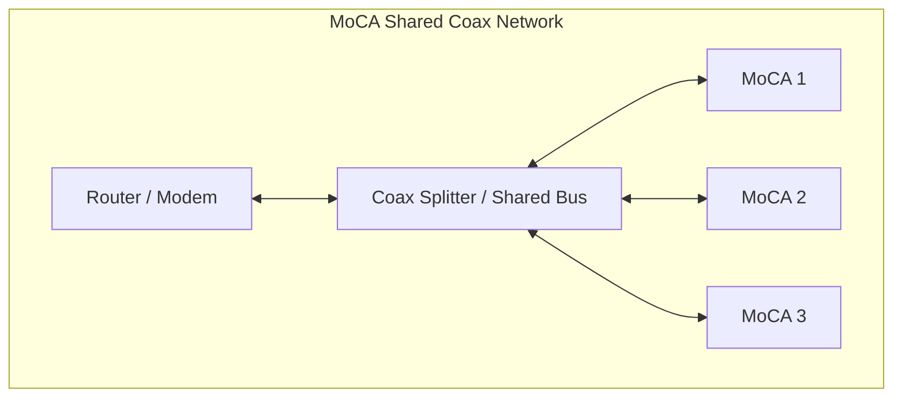
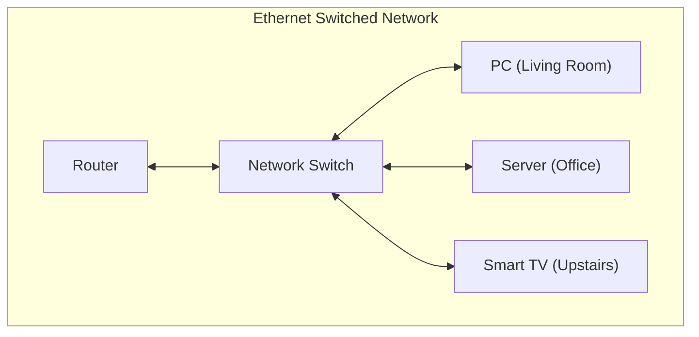

# MoCA Adapters (Deprecated Experiment)
## Overview

MoCA (Multimedia over Coax Alliance) adapters are designed to transmit Ethernet data over existing coaxial cabling.
While useful in homes without Ethernet wiring, they are not well suited for high-performance or multi-device network backbones.

## Why MoCA Is Suboptimal

### Shared-Loop Limitation
Coaxial cabling operates as a **shared bus** — only one device can effectively transmit on the loop at a time.
When multiple adapters are connected, they must wait their turn to send data, introducing contention and latency.
This design severely limits throughput and stability compared to full-duplex Ethernet.

### Packet Loss Under Load
Because of the shared medium, simultaneous data transfers result in collisions and retransmissions.
The result is **measurable packet loss and jitter**, especially noticeable during streaming, SSH sessions, or gaming.

### Interference and Distance Loss
Signal quality degrades quickly across splitters, long coax runs, or older in-wall cabling.
MoCA performs best only with clean, short cable paths and minimal branching.

### Troubleshooting Complexity
Unlike Ethernet, coax networks can hide loops and signal reflections that are difficult to diagnose without specialized tools.

### Visual Example

#### Description of chart
Computer connected via MoCA 1 receive from the router and respond, then has to wait for MoCA 2 and MoCA 3 to receive and respond before it can use the shared loop again. If multple devices are connected on each MoCA, the problem is made even worse

### Regular Ethernet Comparison

#### Description of Chart
While it looks similar, because physically it is, the main difference is that the switch matches sender/receiver pairs by switch port. All device signals can be sent simultaneously and there is no pakcet loss. running an ethernet cable in the house is better than utilizing exisitng coaxial connectors for a stable homelab or multiple device. 
## When It Might Still Be Acceptable
A single-device bridge (e.g., connecting a smart TV or one PC to the router) can work reliably if the coax path is short and isolated.

However, using MoCA as the primary network backbone or multi-node link leads to **performance issues and instability**.

## Personal Note

Originally, the home network used MoCA adapters to link the downstairs modem to the upstairs router via coax.
While functional, the connection suffered from severe packet loss and unpredictable latency.
Replacing the MoCA link with direct Ethernet cabling up the stairs resulted in dramatically improved stability and throughput — confirming that MoCA was a poor fit for core infrastructure