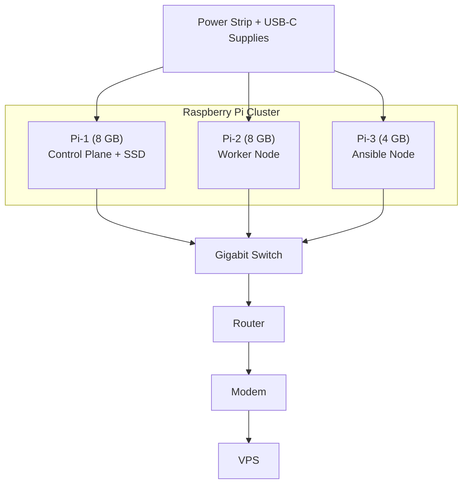

# Cluster Architecture (Hardware Focus)
## Purpose

This page documents the physical architecture of the Raspberry Pi cluster — the layout, power, storage, and connectivity that make up the foundation of the homelab’s control and compute layer.

### The cluster is designed for:
* Energy-efficient 24/7 operation
* Reliability through modularity
* Ease of expansion and experimentation

It forms the backbone of the Kubernetes environment while remaining inexpensive and reproducible.

## 1. Overview

The Raspberry Pi cluster provides a small-scale, low-power compute platform that can mimic production-style distributed systems.
Each node runs a hardened Ubuntu Server installation and is configured for headless operation.

### 3 total nodes
* 1 × Control Plane (8 GB)
* 1 × Worker Node (8 GB)
* 1 × Ansible / Automation Node (4 GB)

### Networking: 
Gigabit Ethernet, connected via managed switch

### Power: 
Individual USB-C supplies on surge-protected power strip

### Storage: 
Combination of external SSDs and microSDs

## 2. Physical Layout

Each node connects via Ethernet to a central switch, which uplinks to the home router.
This keeps network latency consistent and simplifies routing to the WireGuard VPN.

## 3. Node Composition
| Node | Model | RAM | Storage | Purpose | Notes |
|---|
|Pi-1	Raspberry Pi |4 B|	8 GB|	External USB 3 SSD	|Control Plane / main node|	Boots from SSD for reliability
|Pi-2	Raspberry Pi |4 B	|8 GB|	microSD + USB storage|	Worker |node	Handles application workloads
|Pi-3	Raspberry Pi |4 	|4 GB	|microSD (planned SSD)|	Ansible / Automation|	Runs provisioning & backup tasks

All Pis use passive heatsinks and low-profile cooling fans to maintain sustained performance under load.

## 4. Networking & Connectivity
* Primary interface: Gigabit Ethernet (eth0)
* VPN overlay: WireGuard (wg0, 10.100.0.x subnet)
* Switch: Managed gigabit switch provides VLAN support for future segmentation
* Uplink: Router connected to mini-PC and Hetzner VPS via WireGuard

This topology keeps all inter-node communication on a secure, private subnet while enabling remote access through the VPS gateway.

## 5. Power Management

* Each Pi powered by 5 V 3 A USB-C adapter
* All adapters plugged into a surge-protected power bar
* Optional UPS support planned for critical nodes
* Power draw per node: ~7 W idle / 10–12 W load

Total cluster draw: ≈ 30 W typical (≈ $3–4 per month electricity)

## 6. Storage Setup

* Control Plane (Pi-1): 500 GB SSD → OS + persistent volumes
* Worker Node: microSD for OS, optional external drive for app data
* Ansible Node: 128 GB microSD → future SSD for playbooks & backups

Storage is modular — each SSD can be detached and reused in future nodes (mini-PC or NAS).

## 7. Cooling and Physical Arrangement
* Each PI has its own case and power cable
* Black Out curtains + A/C keep room temps low

Cluster placed near switch for short Ethernet runs and minimal clutter.

## 8. Rationale for Raspberry Pi Hardware
### Pros
* **Low Power**:	24/7 uptime without significant electricity cost
* **Educational Value**:	Transparent hardware, ideal for learning Kubernetes
* **Scalability	Easy**: to add or replace nodes
* **Silent Operation**:	Fanless or low-noise cooling
* **Modular Design**:	Each node replaceable without downtime
* **Cost Effective**:	Uses gifted and repurposed hardware

While mini-PCs offer higher performance per node, the Pi cluster remains invaluable for control, testing, and resilience roles within the homelab.

## 9. Future Expansion
* Add SSD to Ansible node for faster automation and backups
* Integrate mini-PC as high-performance worker / future control-plane candidate
* Add NAS for centralized storage and off-Pi backups
* Consider PoE HATs and managed power control for remote reboots

## 10. Summary

The Raspberry Pi cluster is the physical core of the homelab — compact, low-power, and flexible.
It demonstrates that a full Kubernetes environment can be run on inexpensive, off-the-shelf hardware while maintaining reliability and modularity.

This design provides a sustainable foundation for experimentation, orchestration, and future scaling toward mixed Pi + mini-PC clusters.