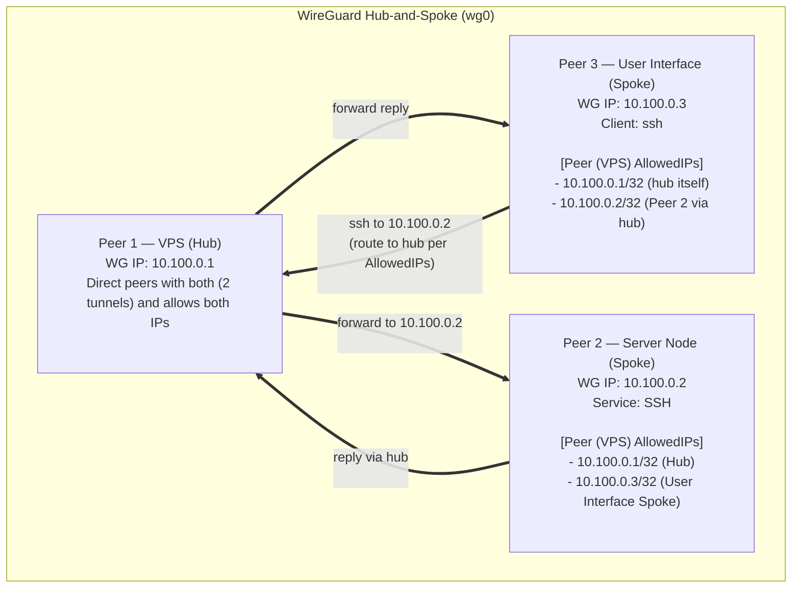

```mermaid
%%{init: {'flowchart': {'padding': 24}}}%%
flowchart TD
  subgraph WG["WireGuard Hub-and-Spoke (wg0)"]
    P1["Peer 1 — VPS (Hub)\nWG IP: 10.100.0.1\nDirect peers with both (2 tunnels) and allows both IPs\n\n"]
    P2["Peer 2 — Server Node (Spoke)\nWG IP: 10.100.0.2\nService: SSH\n\n[Peer (VPS) AllowedIPs]\n- 10.100.0.1/32 (Hub)\n- 10.100.0.3/32 (User Interface Spoke)\n\n"]
    P3["Peer 3 — User Interface (Spoke)\nWG IP: 10.100.0.3\nClient: ssh\n\n[Peer (VPS) AllowedIPs]\n- 10.100.0.1/32 (hub itself)\n- 10.100.0.2/32 (Peer 2 via hub)\n\n"]
  end
  P3 ==>|"ssh to 10.100.0.2\n(route to hub per AllowedIPs)\n\n"| P1
  P1 ==>|"forward to 10.100.0.2\n\n"| P2
  P2 ==>|"reply via hub\n\n"| P1
  P1 ==>|"forward reply\n\n"| P3
```