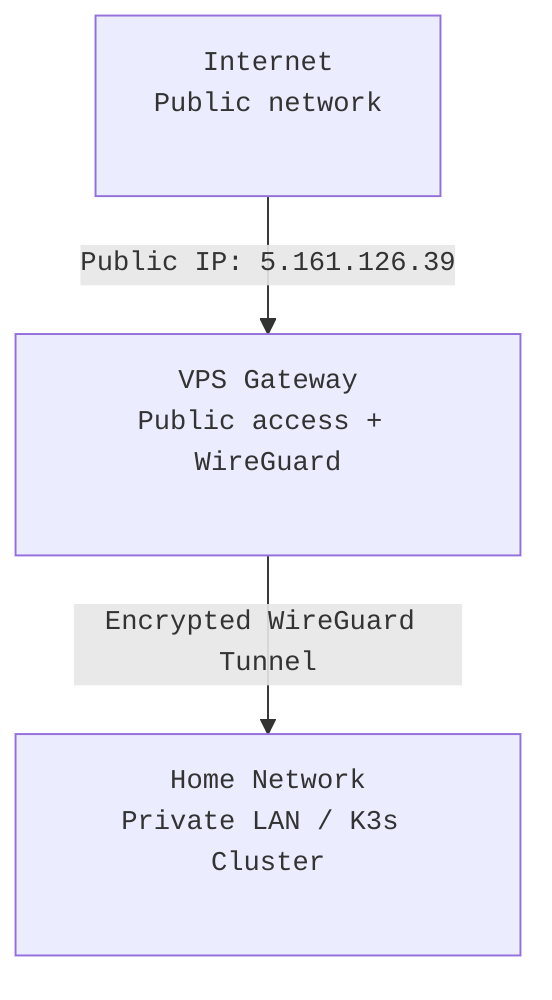

# VPS Gateway

[← Back to Networking Overview](../networking) • [WireGuard Overview](./wireguard) • [Ansible Automation](./ansible-automation.md)

---

## Purpose

The VPS (Virtual Private Server) acts as the **public access point** for all inbound traffic to the homelab.  
It bridges the gap between **public internet users** and **private cluster services** while keeping the **residential IP address hidden**.

The goal is simple:
> Serve applications publicly without directly exposing the home network or devices.

---

## Why Not Direct IP Forwarding?

Exposing a home server directly to the internet through port forwarding or DNS records is **dangerous**.  
It reveals the public IP of your home network, increasing the attack surface for everyone who shares that connection.

### Example: Public IP Discovery
A simple DNS lookup (using a domain that points to a home IP) exposes your residential address:

```bash
nslookup wiki.henryhalldev.com
Name: wiki.henryhalldev.com
Address: 5.161.126.39
```

## Risks
* Public IP exposure: Attackers can easily identify your home network’s entry point.
* Collateral damage: Other users sharing the same internet connection (family, roommates) become vulnerable to attacks targeting your public IP.
* Consumer-grade equipment: Many home routers and IoT devices lack proper hardening or monitoring.
* Attribution issues: Malicious traffic could appear to originate from your home IP, causing ISP-level issues or blacklisting.

### In short: 
Direct forwarding ties your public-facing services to your household. A compromised web app could easily lead to scans, DDoS attempts, or worse against your personal devices.

## The VPS as a Public Gateway
To prevent this, a cloud-based VPS serves as the public ingress point for all self-hosted applications. Instead of exposing the home IP, the VPS handles public DNS, TLS, and routing.
### Design Overview
1. **Cloud VPS**: Deployed at a provider like Hetzner or Linode with a public IPv4/IPv6 address.
2. **WireGuard Tunnel**: Encrypted connection between the VPS and the home cluster.
3. **Ingress Routing**: Public requests (e.g., wiki.henryhalldev.com) terminate on the VPS and are forwarded through WireGuard to internal services.
### Benefits
* **Home IP privacy**: Only the VPS IP is visible to the public.
* **Isolation**: Even if the VPS is compromised, attackers cannot directly access the home LAN.
* **Scalability**: Multiple subdomains and services can route through the same gateway.
* **Simplicity**: End users connect via normal HTTPS domains — no VPN client required.

## Example Architecture

## Implementation Notes
### Network Configuration
* The VPS runs a minimal Linux distro (e.g., Debian or Ubuntu Server).
* WireGuard is configured as a hub, with the home server as a spoke.
* The VPS assigns a private WireGuard IP (e.g., 10.100.0.1) for internal routing.
* Firewall rules restrict public ports to HTTPS, SSH (optional), and VPN traffic only.
### DNS and Domains
* Public subdomains (e.g., wiki.henryhalldev.com, factorio.henryhalldev.com) point to the VPS IP.
* Internal cluster DNS resolves services via WireGuard (e.g., *.local, *.internal).
* The VPS handles TLS termination via a reverse proxy (Traefik or Caddy).
### Security Hardening
* SSH access limited to WireGuard IPs
* Fail2ban and UFW enabled with strict whitelisting
* No privileged containers or direct LAN bridging
* Automated updates and image scanning for vulnerabilities

## Why [Hetzner](https://www.hetzner.com)
[Hetzner](https://www.hetzner.com) is the chosen VPS provider for this setup due to its excellent performance-to-cost ratio, particularly for CPU-bound workloads such as game servers and self-hosted services.

### Advantages of [Hetzner](https://www.hetzner.com) for This Use Case
* **Dedicated vCPU Performance**: Unlike many shared VPS providers, Hetzner Cloud instances deliver near-bare-metal CPU performance ideal for Factorio, Minecraft, and other simulation-heavy services.
* **Affordable Pricing**: High-performance compute instances at a fraction of the cost of AWS or DigitalOcean — perfect for running both production web apps and game servers simultaneously.
* **European Data Centers**: Strong network reliability and latency benefits for U.S.-East and Europe routes; ideal for globally accessible homelab services.
* **Simple Management Tools**: The Hetzner Cloud Console provides easy rebuilds, snapshots, and networking configuration without unnecessary abstraction layers.
* **API Integration**: Future automation (via Ansible or Terraform) can directly manage VPS provisioning, DNS, and firewall rules using Hetzner’s open API.

## Typical Deployment
* **Primary VPS**: 2–4 vCPUs, 4–8 GB RAM — hosts Traefik, Caddy, and WireGuard.
* **Optional Game VPS**: Dedicated instance for Factorio or modded Minecraft servers, connected through the same WireGuard network for monitoring and management.
* **Storage**: Optional NVMe volumes for faster world saves and database writes.
> **Personal Note**
Hetzner offers the best “bang for the buck” for dedicated CPU workloads I’ve tested — outperforming many popular hosts at half the cost.
This allows the same infrastructure to handle web ingress, VPN routing, and CPU-intensive game servers efficiently. 
>
## Integration with WireGuard
The VPS and the homelab are connected by a persistent WireGuard tunnel:
* **VPS interface**: wg0 → 10.100.0.1
* **Home node interface**: wg0 → 10.100.0.2
* Allowed IPs **restricted** to necessary subnets (10.100.0.0/24, service CIDRs, etc.)

All traffic between these networks flows exclusively through WireGuard, ensuring encryption and endpoint authenticity.

> 🔗 See [WireGuard Overview](/public/infrastructure/networking/wireguard) for details on the VPN configuration and topology.

## Monitoring and Maintenance
* Uptime Monitoring: Health checks for VPN and proxy endpoints using Uptime Kuma or Grafana.
* Log Centralization: Forward logs from the VPS (Caddy, Traefik, WireGuard) to Loki or a local syslog server.
* Periodic Audits: Trivy image scanning, SSH key review, and security updates applied weekly.

## Summary
The VPS Gateway is the secure bridge between the public internet and the private homelab.
By routing all external traffic through a hardened, cloud-based intermediary hosted on Hetzner, the architecture maintains:
* Full home IP protection
* Clear network segmentation between environments
* Strong encryption and policy enforcement
* Excellent CPU performance for both web and game hosting
* A consistent, domain-based user experience

This model achieves the best of both worlds — public accessibility without sacrificing privacy, performance, or network safety.