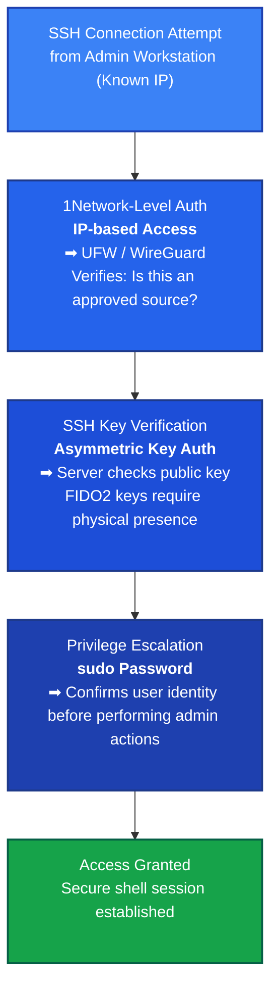

# Firewall Configuration (UFW)
## Purpose

The Uncomplicated Firewall (UFW) provides a simple and reliable interface for configuring Linux iptables.
It enforces a default deny policy on all inbound traffic while allowing outbound communication.
This ensures only explicitly permitted connections (like SSH or application ports) are reachable.

A properly configured UFW baseline is a prerequisite before integrating WireGuard or exposing any public-facing services.

## 1. Install and Enable UFW
```bash
sudo apt install ufw -y
sudo systemctl enable ufw
```

### Confirm installation:

```bash
sudo ufw status
```

Output should indicate that the firewall is currently inactive.

## 2. Set Baseline Policy

### Set the default rules so that inbound connections are denied unless explicitly allowed.
```bash
sudo ufw default deny incoming
sudo ufw default allow outgoing
```

#### This ensures:
* Nothing can connect inbound unless allowed.
* Outbound traffic from the node (updates, API calls, DNS, etc.) is unaffected.

## 3. Allow SSH Access

Before enabling the firewall, **you must allow SSH**, or you’ll lock yourself out.
```bash
sudo ufw allow 22/tcp
```

If SSH runs on a different port (e.g., 2222):
```bash
sudo ufw allow 2222/tcp
```
Always verify your SSH port before proceeding.
**Enabling UFW without allowing SSH** first will **drop your remote connection immediately**.

## 4. (Optional) Allow Node-Specific Ports
> To follow least privilege principles, only allow services that are neccessary.
**SKIP THIS STEP UNLESS YOU SPECIFICALLY WANT TO ALLOW TRAFFIC IN**

You can allow other service ports as needed — for example:

|Service	|Port|	Purpose
|---|
|HTTP	|80/tcp	|Web traffic (Caddy, Traefik, etc.)
|HTTPS	|443/tcp	|Secure web traffic
|K3s API (control-plane)	|6443/tcp	|For K3s control-plane communication
Application service|	Custom	|Define per node

### Example:

```bash
sudo ufw allow 443/tcp
sudo ufw allow 6443/tcp
```

You can later tailor these for control-plane vs worker nodes.

## 5. Enable the Firewall

### Once SSH is allowed and any necessary service ports are open, enable the firewall:
```bash
sudo ufw enable
```

You’ll be prompted for confirmation — type y and press Enter.

## 6. Verify Status

### Check that UFW is active and rules are applied:
```bash
sudo ufw status verbose
```

### Expected output:
```bash
Status: active
Logging: on (low)
Default: deny (incoming), allow (outgoing), disabled (routed)
New profiles: skip
To                         Action      From
--                         ------      ----
22/tcp                     ALLOW       Anywhere
22/tcp (v6)                ALLOW       Anywhere (v6)
```
## Further SSH Firewall Hardening Tip - Allow by IP
### In above Example: 
**SSH is allowed in from anywhere. Complete reliance on assymetric/password authentication** 
* *OK* for very first baseline. 
* **Suboptimal** for long term use. 
### Find Workstation/User Interface IP
#### Linux
```bash
ip addr show
```
##### Look For output:
```bash
    inet 192.168.1.23/24 metric 100 brd 192.168.50.255 scope global dynamic enp2s0
       valid_lft 78683sec preferred_lft 78683sec
```
#### Windows-Powershell
```bash
Get-NetIPAddress
```

##### Look For Output: 
```bash
IPAddress         : 192.168.1.23
InterfaceIndex    : 2
InterfaceAlias    : Ethernet
AddressFamily     : IPv4
Type              : Unicast
PrefixLength      : 24
PrefixOrigin      : Dhcp
SuffixOrigin      : Dhcp
AddressState      : Preferred
ValidLifetime     : 23:00:32
PreferredLifetime : 23:00:32
SkipAsSource      : False
PolicyStore       : ActiveStore
```
### Restrict 22 to a sepcific IP, such as a workstation or user interface
#### Add new more secure rule
```bash
# Allow SSH only from your management host
sudo ufw allow from 192.168.1.23 to any port 22 proto tcp
```
#### Remove Previous Rule
```bash
# Remove global rule
sudo ufw delete allow 22/tcp
```

Along with Deny Inbound Default, this means only your machine specified can SSH to the machine. 
#### layered SSH security approach

## 7. Confirm SSH Connectivity

### Keep your current SSH session open and open a second terminal to verify you can reconnect:
```bash
ssh dev@<node-ip>
```

If the new session **connects successfully**, your **firewall baseline is safe**.

If it **fails**, return to your original session and **check**:

```bash
sudo ufw status
sudo journalctl -u ufw --since "5m"
```
## 8. Next Step: WireGuard Integration

Once SSH has been verified through the firewall, proceed to integrate WireGuard.
After WireGuard is configured and tested, you’ll restrict SSH to VPN-only access — removing direct internet exposure.

>[See WireGuard Integration](/public/infrastructure/networking/wireguard) 

## Summary

### Your node now has a baseline firewall policy:
* Default deny inbound
* Allow outbound
* Permit SSH only from a specific machine(temporary until WireGuard is in use)

This configuration ensures the node remains reachable while maintaining a secure, minimal attack surface for further hardening and network integration.